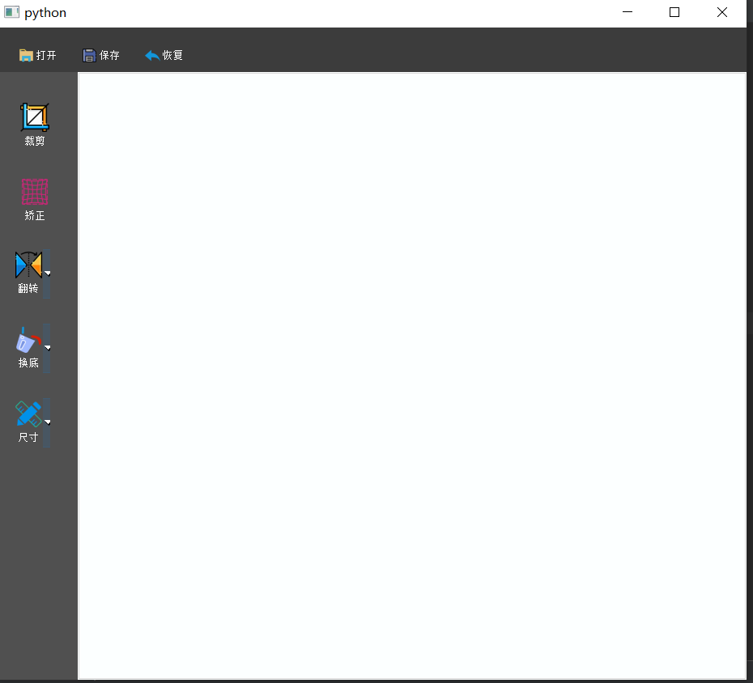

<div id="top"></div><div id="top"></div>

# ID_Photo_Tool
<!-- 目录 -->
<details>
  <summary>目录</summary>
  <ol>
    <li>
      <a href="#关于本项目">关于本项目</a>
    </li>
    <li>
      <a href="#开始">开始</a>
      <ul>
        <li><a href="#依赖">依赖</a></li>
        <li><a href="#安装">安装</a></li>
      </ul>
    </li>
    <li><a href="#使用方法">使用方法</a></li>
    <li><a href="#贡献">贡献</a></li>
    <li><a href="#许可证">许可证</a></li>
    <li><a href="#联系作者">联系作者</a></li>
  </ol>
</details>


<!-- 关于本项目 -->
## 关于本项目





这是一个使用OpenCV和PyQt开发的处理证件照的工具，可以把图片导入操作界面中，实现了常用的裁剪、矫正、翻转、换底、尺寸变换等功能。

项目要点：
* 能够把常用图片格式(jpg,png,jpeg)导入到操作界面
* 可以对修改后的图片进行保存，也可恢复到图片的初始状态
* 可以对图片进行裁剪
* 如果证件(身份证、驾照等)有倾斜，可以进行矫正
* 可以对图片进行翻转（水平翻转、垂直翻转、180度翻转）
* 可以对图片进行换底（红、蓝、白）三色互转
* 可以对图片尺寸进行变换（一寸、二寸）
* 有兴趣欢迎加入一起开发，联系方式在页面底部


<p align="right">(<a href="#top">返回顶部</a>)</p>


<!-- 开始 -->
## 开始

这是一份在本地构建项目的指导的例子。
要获取本地副本并且配置运行，你可以按照下面的示例步骤操作。

### 依赖

这只是一个列出软件依赖和安装方法的例子。
* pip
  ```sh
  pip install -r requirements.txt
  ```

### 安装


1. 克隆本仓库
   ```sh
   git clonehttps://github.com/liqiu123456123/ID_photo.git
   ```
2. 直接下载本项目源码

<p align="right">(<a href="#top">返回顶部</a>)</p>


<!-- 使用方法 示例 -->
## 使用方法

运行main.py开始运行，放操作过程截图。


<p align="right">(<a href="#top">返回顶部</a>)</p>


<!-- 贡献 -->
## 贡献

如果你想参与本项目的开发，请不要客气！
贡献让开源社区成为了一个非常适合学习、启发和创新的地方。你所做出的任何贡献都是**受人尊敬**的。

如果你有好的建议，请复刻（fork）本仓库并且创建一个拉取请求（pull request）。你也可以简单地创建一个议题（issue），并且添加标签「enhancement」。不要忘记给项目点一个 star！再次感谢！

1. 复刻（Fork）本项目
2. 创建你的 Feature 分支
3. 提交你的变更 
4. 推送到该分支 
5. 创建一个拉取请求（Pull Request）

<p align="right">(<a href="#top">返回顶部</a>)</p>


<!-- 许可证 -->
## 许可证

根据 MIT 许可证分发。打开 [LICENSE.txt](LICENSE.txt) 查看更多内容。


<p align="right">(<a href="#top">返回顶部</a>)</p>


<!-- 联系作者 -->
## 联系作者

* 邮箱：liqiu6789@qq.com
* qq：674658532
* 微信:liqiu6746

* 项目链接: [https://github.com/liqiu123456123/ID_photo](https://github.com/liqiu123456123/ID_photo)

<p align="right">(<a href="#top">返回顶部</a>)</p>
